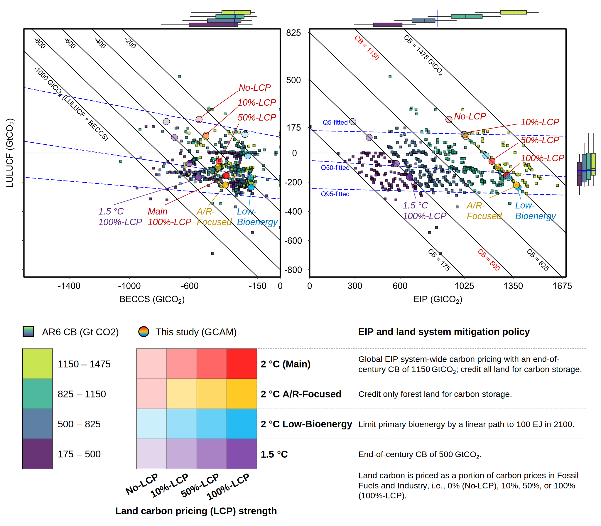
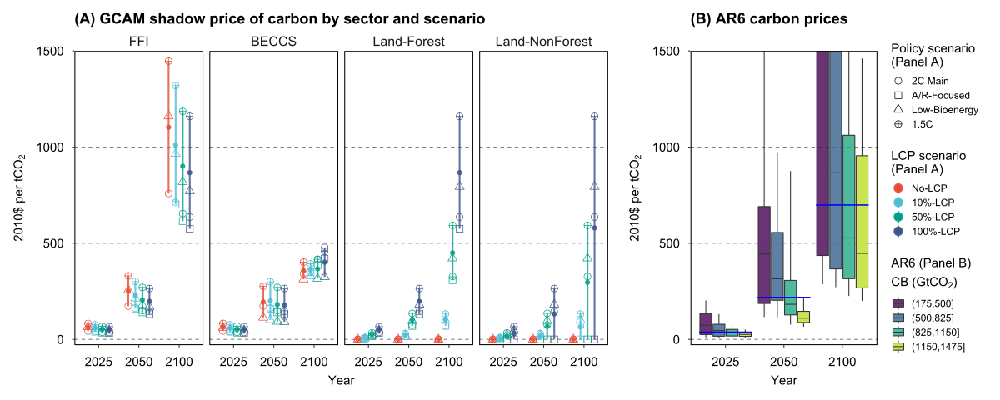
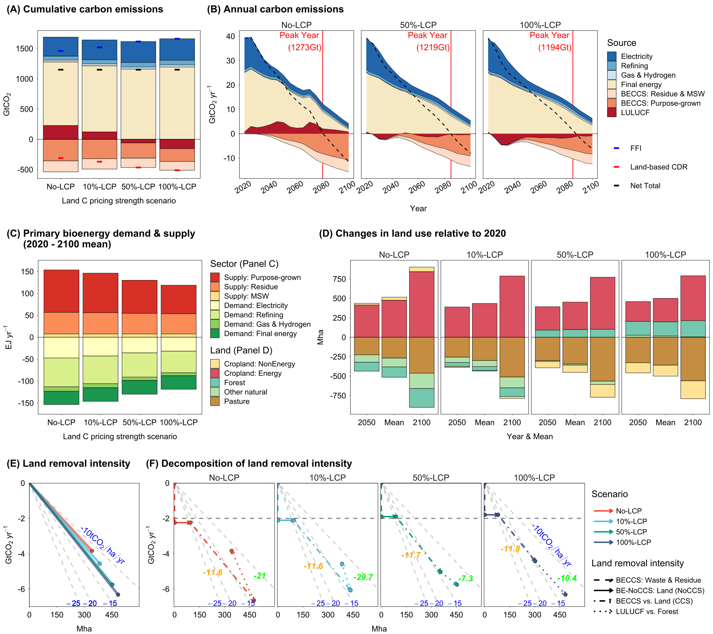
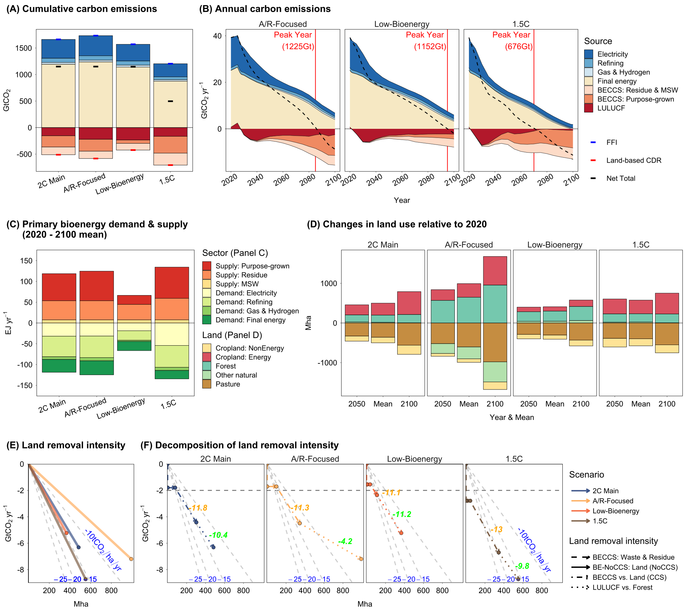
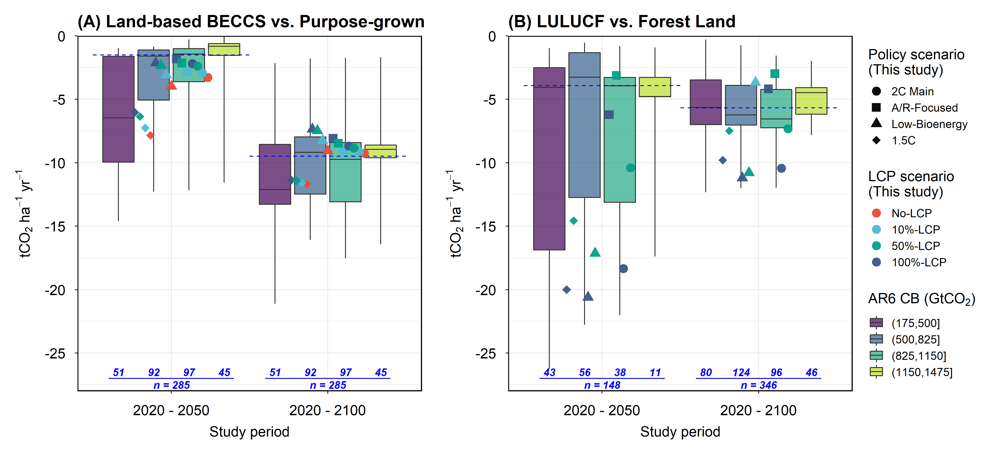
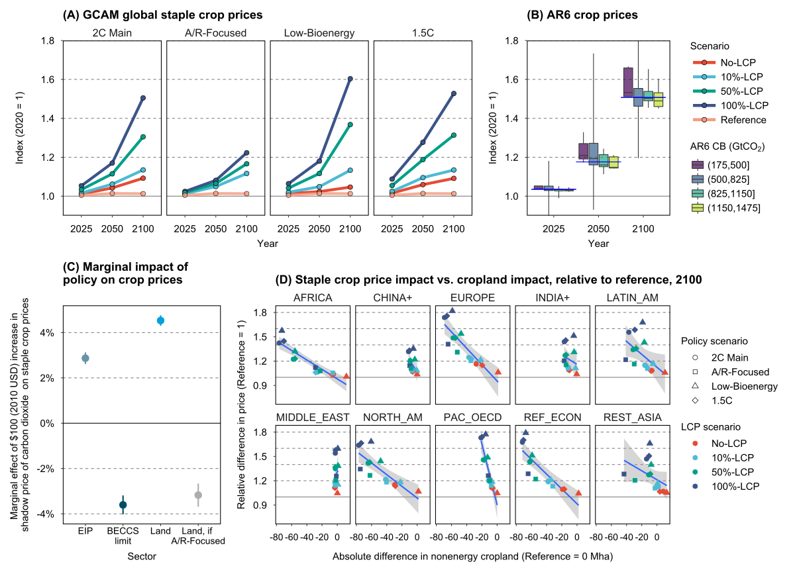

# paper-LandBasedCDR-DisplayItems
This repository includes an R project (R codes, functions, and data) for generating key figures in the paper (nature communications):  
  
**Trade-Offs in Land-Based Carbon Removal Measures under 1.5°C and 2°C Futures**  

Xin Zhao<sup>a*</sup>, Bryan K. Mignone<sup>a</sup>, Marshall A. Wise<sup>a</sup>, and Haewon C. McJeon<sup>a</sup>  
<sup>a</sup>Joint Global Change Research Institute, Pacific Northwest National Laboratory  
<sup>b</sup>ExxonMobil Research and Engineering Company  
*Corresponding Author. Email: xin.zhao@pnnl.gov

Project Manager  
Haewon C. McJeon 	(May 2021 - July 2023)  
Matthew Binsted 	(August 2023 -)  

# Instruction
Download the entire R project and run `R/main.R`. The script will source two scripts, `R/AR6/AR6_main.R` and `R/GCAM/GCAM_main.R`, to generate figures or datasets related to AR6 scenario data and GCAM results, respectively. These scripts will further  source and run functions to generate figures and datasets, which will be saved in  `output/GCAM/Main` or `output/GCAM/SI`.

## Package output and size
The package output includes figures and datasets (`output/*` included in this repo). The size of the output is about 50MB. The total size of the repo is about 100MB.  

## Package data
`output/FigDataRDS/*.rds`: 	Intermediate data used for generating figures (20MB)
`data/AR6/*`: 				Processed AR6 data
`data/AR15/*`: 				Processed AR6 data
`data/maps/*`: 				Mapping files
*Note that the GCAM model and files needed for replicating the runs are archived at [realxinzhao/paper-LandBasedCDR-GCAM](https://github.com/realxinzhao/paper-LandBasedCDR-GCAM). The source database could be a few Gigabytes so they are not included here. However, the raw queried output datasets are archived at [zenodo.org/record/8244015](https://zenodo.org/record/8244015).*

## Functions
Figures or figure sets are written in independent  functions (`R/AR6/*.R` and `R/GCAM/*.R`). Helper functions to help data processing are stored in `R/helper_func/*.R`. All functions are sourced in a nested structure so that the global environment is utilized.  


## R Session Information (renv used but deacviated)
```
R version 4.1.0 (2021-05-18)
Platform: x86_64-w64-mingw32/x64 (64-bit)
Running under: Windows 10 x64 (build 19045)

attached base packages:
stats     graphics  grDevices utils     datasets  methods   base     

other attached packages:
RColorBrewer_1.1-2 cowplot_1.1.1      broom_0.7.6        scales_1.1.1       stringr_1.4.0      sf_1.0-1           ggsci_2.9         
ggthemes_4.2.4     readxl_1.3.1       quantreg_5.93      SparseM_1.81       patchwork_1.1.1    gcamdata_1.1       tidyr_1.1.3       
ggplot2_3.3.5      dplyr_1.0.6 

loaded via a namespace (and not attached):
tidyselect_1.1.1   purrr_0.3.4        splines_4.1.0      lattice_0.20-44    colorspace_2.0-1   vctrs_0.3.8        generics_0.1.0    
viridisLite_0.4.0  mgcv_1.8-35        utf8_1.2.1         XML_3.99-0.6       survival_3.2-11    rlang_1.0.6        e1071_1.7-7       
pillar_1.7.0       glue_1.4.2         withr_2.5.0        DBI_1.1.1          lifecycle_1.0.3    MatrixModels_0.5-0 munsell_0.5.0     
gtable_0.3.0       cellranger_1.1.0   labeling_0.4.2     class_7.3-19       fansi_0.4.2        Rcpp_1.0.8.3       KernSmooth_2.23-20
readr_1.4.0        backports_1.2.1    classInt_0.4-3     farver_2.1.0       gridExtra_2.3      digest_0.6.27      hms_1.1.1         
stringi_1.6.1      grid_4.1.0         cli_3.6.0          tools_4.1.0        magrittr_2.0.1     proxy_0.4-26       tibble_3.1.2      
crayon_1.4.1       pkgconfig_2.0.3    ellipsis_0.3.2     MASS_7.3-54        Matrix_1.3-3       data.table_1.14.0  xml2_1.3.2        
viridis_0.6.2      assertthat_0.2.1   rstudioapi_0.13    R6_2.5.0           nlme_3.1-152       units_0.7-2        compiler_4.1.0      
```

# Key Figures

**Fig.1 Contributions of land-based carbon dioxide removal measures.** The left panel shows the relationship between global cumulative CO2 removals/emissions in 2020 – 2100 for LULUCF and BECCS, while the right panel shows the relationship between LULUCF and Energy and Industrial Process (EIP) emissions, projected by climate change mitigation pathways. Each dot represents a projection from an IPCC AR6 pathway (square) or a mitigation pathway generated in the present study using GCAM (round). The square dots (n = 604) in both panels are projections from IPCC AR6 1.5 °C and 2 °C pathways and with Carbon Budgets (CBs) in [175, 1475] GtCO2, distinguished by CB subranges (filled color). The boxplots on the sides show the median values (line), the 1st and 3rd quartiles (boxes), and the 5 – 95 percentile ranges (whiskers) of the AR6 pathways; the blue line on the boxplots shows the median value of the full range. The blue dotted lines in the main panels are fitted using quantile regression at the 5th, 50th, and 95th percentiles. The round dots (n = 15) represent GCAM projections, with scenarios distinguished by filled colors and described in the legend. Note that Main and A/R-Focused scenarios are identical under no land mitigation policy (No-LCP). Points on a diagonal line in a panel have the same total removals/emissions, i.e., land-based carbon removals (left) or CBs (right). The beta coefficient between LULUCF and BECCS, with CB controlled, stands at -0.17 for AR6 pathways. In contrast, the corresponding value for GCAM scenarios studied is -0.86 (-2 for the 2°C Main scenarios). For more details about AR6 pathways, see Section S1. Data source: AR6 Scenario Database and GCAM simulation results.      
  


**Fig.2 Carbon prices in mitigation pathways.** Panel (A) displays the shadow price of carbon by sector across pathways investigated in this study, with each dot representing the projected carbon price in a study year and sector, distinguished by policy scenario (point shape) and land-system carbon pricing (LCP) scenario (color). The corresponding point-range per LCP scenario group is added with a line indicating the range of the dots and a solid dot indicating the mean value. Note that the difference in the shadow price of carbon across sectors reflects various mitigation policy choices. Panel (B) shows the carbon price distributions across AR6 pathways (n = 565) by year and Carbon Budget (CB) subranges. The boxplots show the median values (horizontal line within the boxes), interquartile range (boxes), and the 10th – 90th percentile ranges (whiskers) of the AR6 pathways (truncated at a maximum of $1500 per tCO2); the blue line on the boxplots shows the median value of the full CB range. Additional information is provided in Fig. S13 and Tables S3 and S4. Data source: GCAM simulation results and AR6 Scenario Database.  
  


**Fig. 3 Impact of land carbon pricing strength on key outcomes under 2 °C scenarios.** Projections from the Main (2 °C) scenarios with varying land carbon pricing strengths, from no land carbon pricing (No-LCP) to 100% land carbon pricing (100%-LCP), are presented for global cumulative (A) and annual (B) carbon emissions, primary bioenergy demand and supply (C), land use change (D), land removal intensity (E), and the decomposition of land removal intensity (F). All scenarios have a net total cumulative emissions of 1150 GtCO2. Carbon dioxide emissions/removals in panels (A) and (B) show contributions by Fossil Fuels and Industry (FFI), BECCS (by feedstock sources: residue & MSW or purpose-grown energy crop), and LULUCF. The final energy sectors include industry, buildings, and transportation. The peak carbon emission year and corresponding cumulative emissions are highlighted (red vertical lines) in panel (B). Stacked bars in panel (C) show the 2020 – 2100 mean primary second-generation bioenergy supply by source (positive values) and demand by sector (negative values). Stacked bars in panel (D) present land use change decomposition by 2050 and 2100 and the mean value in 2020 – 2100. Points in panel (E) present the relationship between the 2020 – 2100 mean land-based CDR and the corresponding land utilized so that the slope of the lines is a measure of the 2020 – 2100 mean land removal intensity. The slope of background lines (grey), for reference, is labeled (in blue with a unit of tCO2 per hectare per year). Panel (F) decomposes panel (E) by land-based CDR sources and the corresponding land use, including waste & residue-based BECCS (vertical lines; no land attribution), energy cropland for bioenergy used in sectors without CCS (horizontal lines; no CCS attribution), energy crop-based BECCS vs. energy cropland for bioenergy used in CCS sectors (slopes annotated in orange), and LULUCF vs. forest (slopes annotated in green). Data source: GCAM simulation results.   
  


**Fig. 4 Impact of alternative energy and land system policies on key outcomes under 100% land carbon pricing.** Projections from scenarios with alternative energy and land system policies, including 2 °C (main), A/R-Focused, Low-Bioenergy, and 1.5 °C, are presented for global cumulative (A) and annual (B) carbon emissions, primary bioenergy demand and supply (C), land use change (D), land removal intensity (E), and the decomposition of land removal intensity (F). All scenarios have 100% land carbon pricing (100%-LCP) in which land carbon is priced at the Fossil Fuels and Industry (FFI) carbon prices. See Fig. 3 caption for detailed panel descriptions. Data source: GCAM simulation results.  
  


**Fig. 5 Land carbon removal intensity.** Panels (A) and (B) show land carbon removal intensity for energy crop-based BECCS versus purpose-grown energy cropland and LULUCF versus forest land, respectively. The dots in each panel represent mean projections from the present study (GCAM) by study period (2020 – 2050 or 2020 – 2100), policy scenario (point shape), and land-system carbon pricing (LCP) scenario (color). The boxplots exhibit the distribution of results across AR6 pathways, including the median (horizontal line within the boxes), interquartile range (boxes), and 5 – 95 percentile range (whiskers) by study period and Carbon Budget (CB) subrange. The blue dotted line represents the median value in the full CB range for the available AR6 pathways. Note that only a subset of AR6 pathways reported quality land projections. We cannot further decompose BECCS removal intensity for AR6 pathways to associate purpose-grown cropland with CCS sectors due to inadequate and/or low-quality reporting of the relevant data needed. In Panel (B), pathways or study periods with net global deforestation were removed for meaningful comparisons of the removal intensity, and negative values represent net removal in the study period. The number of AR6 pathways by CB subrange is annotated in blue. Data sources: GCAM simulation results and AR6 Scenario Database.  



**Fig. 6 Implications of land-based mitigation on crop prices.** Panel (A) displays the staple crop price index (2020 = 1) in pathways explored in this study, with each dot representing the crop price in a projection year (i.e., 2025, 2050, 2100), distinguished by policy scenarios (subpanels), and scenarios (lines & colors). Staple crop in GCAM is an aggregation of wheat, corn, rice, other grains, and root & tuber (Table S2). Panel (B) shows the crop price index (2020 = 1) distributions across AR6 pathways (n = 28) and crops (n <= 4) by year and Carbon Budget (CB) subranges. AR6 crops include wheat, corn, rice, and soybean. The boxplots show the median (horizontal line within the boxes), interquartile range (boxes), and 5 – 95 percentile range (whiskers) by study period and CB subrange. The blue line represents the median value in the full CB range. Panel (C) shows the marginal effect on staple crop prices (dots) from a $100 (2010 USD) increase in the shadow price of carbon dioxide by sector. The coefficients correspond to Model 4 in Table S7. Error bars represent the 95% confidence intervals (CI) of each coefficient. Panel (D) shows the relationship (point) between staple crop price impact (reference = 1) and cropland impact (reference = 0 Mha) in 2100 across LCP scenarios (point colors) and policy scenarios (point shapes) by AR6 R10 regions (subpanels; see Table S1 for mappings). Linear trend lines (blue lines) and 95% CI (grey ribbons) are added for each region (subpanel). Data source: GCAM simulation results and AR6 Scenario Database.  

#Acknowledgments
The PNNL authors acknowledge support from the ExxonMobil Technology and Engineering Company. The views and opinions expressed are those of the authors alone. We appreciate Matthew Binsted for managing the project in its later stages. We extend our gratitude to Kate Calvin, Jae Edmonds, Ben Bond-Lamberty, Yang Ou, Jay Fuhrman, Pralit Patel, Dalei Hao, Patrick O’Rourke, Brinda Yarlagadda, Xueyuan Gao, Alan Di Vittorio, Kanishka Narayan, Ryna Cui, and Page Kyle for their valuable comments and suggestions.
